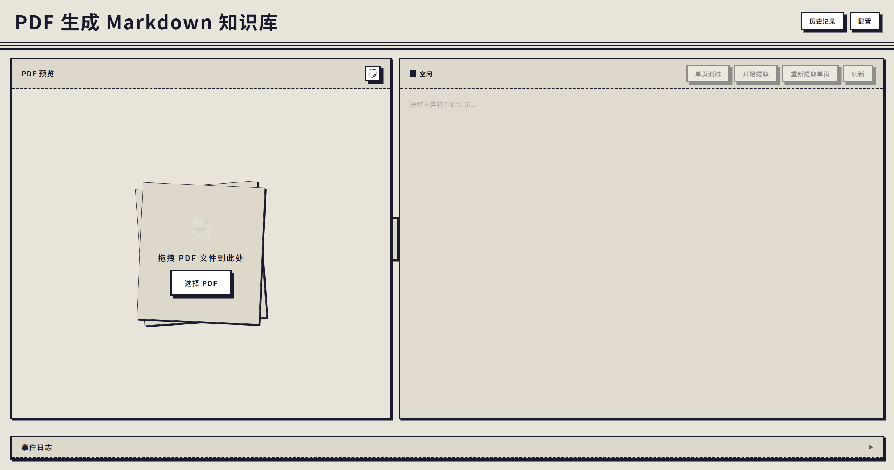

# PDF → Markdown 知识库

把 PDF 加工成 Markdown 知识库的本地 Web 应用。

```
上传 PDF → 并发抽取 → 合并输出 → 编辑 / 下载 Markdown
```

---

## 功能

- **并发抽取**：按页并发调用豆包大模型，实时 SSE 推送进度。
- **单页预览**：正式提交前可对任意单页试抽，验证 prompt 效果。
- **页级工作区**：左栏浏览 PDF，右栏编辑对应页 Markdown；失败页可单独重试。
- **合并输出**：将所有页面合并为最终 Markdown，支持多种合并模式。
- **Web 配置面板**：界面内直接设置 API Key、模型、DPI、并发数和 prompt，无需手动改配置文件。

## 截图




---

## 前置条件


| 工具               | 版本要求   | 获取                                                                                          |
| ---------------- | ------ | ------------------------------------------------------------------------------------------- |
| Python           | ≥ 3.12 | [python.org](https://www.python.org/)                                                       |
| uv               | 最新     | `pip install uv` 或见 [astral.sh/uv](https://docs.astral.sh/uv/getting-started/installation/) |
| 火山引擎 ARK API Key | —      | [控制台](https://console.volcengine.com/ark)                                                   |


---

## 快速开始

```bash
# 1. 克隆
git clone <repo-url>
cd pdf2md-kit

# 2. 配置 API Key（二选一）
cp .env.example .env          # 然后编辑 .env，填入 ARK_API_KEY
# 或在 Web 界面的「配置」面板中直接粘贴 Key

# 3. 启动服务（自动同步依赖）
./init.sh serve

# 浏览器打开
open http://127.0.0.1:8000
```

`init.sh serve` 会一次性完成依赖同步 + 服务器启动，无需额外步骤。

---

## 配置

项目有两处配置：

### `config.yaml`

控制模型与抽取行为，修改后重启生效；也可在 Web 配置面板中实时调整：

```yaml
model:
  name: "doubao-seed-2-0-lite-260215"
  timeout_seconds: 60

extract:
  dpi: 150          # 页面渲染分辨率，越高越清晰但越慢
  concurrency: 10   # 并发抽取页数
  max_retries: 3    # 单页失败后最大重试次数
  prompt: |         # 可自定义 prompt
    ...
```

### API Key

优先级：Web 界面配置面板 > `.env` 文件中的 `ARK_API_KEY`。  
密钥存储在 `data/secrets.json`。

---

## 运行测试

```bash
./init.sh test                                                    # 全量测试
./init.sh test tests.architecture.test_architecture_boundaries   # 指定模块
```

---

## 常用命令一览

```bash
./init.sh setup              # 仅同步依赖，不启动
./init.sh serve              # 启动在 127.0.0.1:8000
./init.sh serve 0.0.0.0 8080 # 指定 host:port
./init.sh test               # 全量测试
./init.sh help               # 查看帮助
```